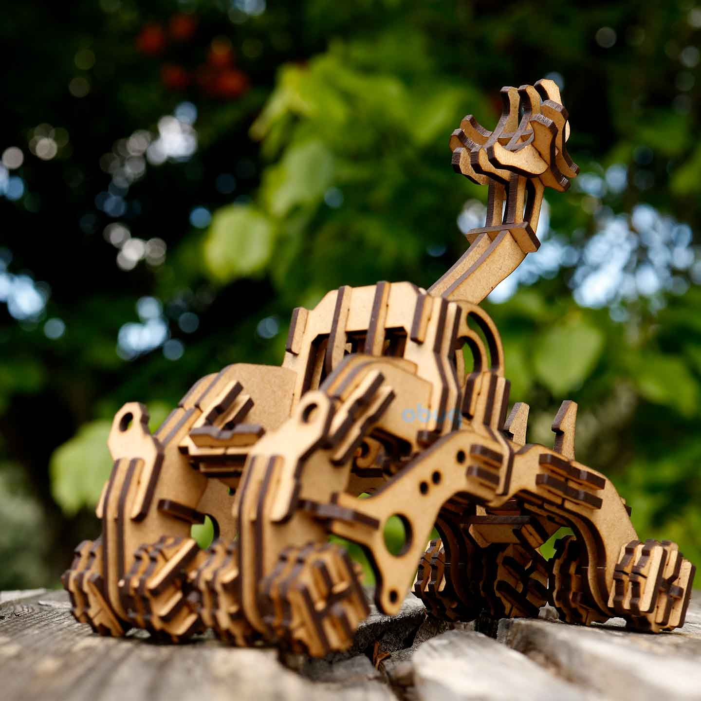

# Axis Catapult



More information and additional images:  
https://obuqdesign.wordpress.com/2024/02/16/axis-catapult/

<br>

## Details

| Property | Value |
|---|---|
| Type | Tridimensional model (124 pieces) |
| Designed for | 3mm mdf or plywood |
| Dimensions | Height: 170mm; Length: 170mm; Width: 96mm |
| Design file format | DXF R14 |
| Units | mm |
| Frame | 200x300mm (x2) |
| Scalable | Yes |

<br>
<hr>
<br>

<div align="center">
  If you like this design and would like to support my work:
  <br><br>
  https://buymeacoffee.com/obuq
</div>

<br>
<hr>
<br>

<div align="center">

#### Thank you to all the patrons that supported me when this design was initially posted on Patreon

<br>

Roman Kupalov  
F  
patreon person  
Wouter Simons  
Bob-Bob Bob-Bob  
Peter Trzos  
Zak  
Julie Sturgeon  
Todd  
Rudenz Schulz  
Laura Culp  
Darkly Labs  
Aaron J Radke  
Renzo Ciarma  
Ray

</div>
```
